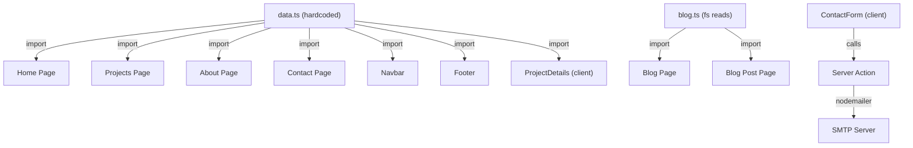

# 🔍 Portfolio Website — Comprehensive Technical Audit

**Audit Date**: July 4, 2026  
**Auditor**: Senior Full-Stack Engineer & Solutions Architect  
**Repository**: `e:\WORKS\portfolio`

---

## 1. Tech Stack & Dependency Audit

### Core Stack Identified

| Technology | Version | Latest (Jul 2026) | Status |
|---|---|---|---|
| **Next.js** | `^16.1.1` | ~16.x | ✅ Reasonably current |
| **React** | `19.2.0` | 19.x | ✅ Current |
| **TypeScript** | `^5` | 5.x | ✅ Current |
| **Tailwind CSS** | `^4` | 4.x | ✅ Current (v4 architecture) |
| **Node.js** | Not pinned | 22 LTS / 24 | ⚠️ No `.nvmrc` / `engines` field |

### Dependency-by-Dependency Analysis

#### Production Dependencies

| Package | Version | Verdict |
|---|---|---|
| `@tailwindcss/typography` | `^0.5.19` | ⚠️ **Version mismatch** — This is the v3-era plugin. Tailwind v4 uses `@plugin` directive (which you *are* using in CSS), but the npm package version should be aligned with the Tailwind v4 plugin system. |
| `@types/nodemailer` | `^7.0.4` | ⚠️ **Misplaced** — Type packages belong in `devDependencies`, not `dependencies`. |
| `clsx` | `^2.1.1` | ✅ Fine, but **unused** — no imports found anywhere in the codebase. |
| `framer-motion` | `^12.23.25` | ✅ Current |
| `gray-matter` | `^4.0.3` | ✅ Stable, no major changes |
| `lucide-react` | `^0.555.0` | ✅ Current |
| `next` | `^16.1.1` | ✅ Current |
| `next-mdx-remote` | `^5.0.0` | ✅ Current |
| `next-themes` | `^0.4.6` | ✅ Current |
| `nodemailer` | `^7.0.12` | ✅ Current |
| `react` / `react-dom` | `19.2.0` | ✅ Current, but **pinned** (no `^`) — intentional or oversight? |
| `tailwind-merge` | `^3.4.0` | ⚠️ **Unused** — no imports of `tailwind-merge` found anywhere in the codebase. |

#### Dev Dependencies

| Package | Version | Verdict |
|---|---|---|
| `@tailwindcss/postcss` | `^4` | ✅ Correct for TW v4 |
| `@types/node` | `^20` | ⚠️ Should be `^22` to match Node 22 LTS |
| `@types/react` / `@types/react-dom` | `^19` | ✅ Matches React 19 |
| `eslint` | `^9` | ✅ Current |
| `eslint-config-next` | `^16.1.1` | ✅ Matches Next.js version |
| `tailwindcss` | `^4` | ✅ Current |
| `typescript` | `^5` | ✅ Current |

### Key Dependency Issues

> [!WARNING]
> **Unused packages detected**: `clsx` and `tailwind-merge` are installed but never imported. These add ~15KB to `node_modules` and represent dead weight.

> [!IMPORTANT]
> **Missing critical tooling**: No Prettier, no Husky/lint-staged, no test framework (Jest/Vitest/Playwright), no `@next/bundle-analyzer`. For a 2026 portfolio, these are expected standards.

---

## 2. Architecture & Directory Structure

### High-Level Structure Map

```
portfolio/
├── .env                          # ⚠️ SECURITY CONCERN (see §5)
├── .gitignore
├── docs/
│   └── Portfolio SRS.pdf         # Spec doc (not referenced by app)
├── eslint.config.mjs
├── next.config.ts
├── package.json
├── postcss.config.mjs
├── public/
│   ├── file.svg                  # 🔴 Default Next.js scaffolding (unused)
│   ├── globe.svg                 # 🔴 Default Next.js scaffolding (unused)
│   ├── next.svg                  # 🔴 Default Next.js scaffolding (unused)
│   ├── vercel.svg                # 🔴 Default Next.js scaffolding (unused)
│   └── window.svg                # 🔴 Default Next.js scaffolding (unused)
├── src/
│   ├── app/
│   │   ├── globals.css
│   │   ├── layout.tsx            # Root layout
│   │   ├── page.tsx              # Home page
│   │   ├── about/page.tsx
│   │   ├── blog/
│   │   │   ├── page.tsx
│   │   │   └── [slug]/page.tsx
│   │   ├── contact/
│   │   │   ├── page.tsx
│   │   │   └── actions.ts        # Server Action (email)
│   │   └── projects/
│   │       ├── page.tsx
│   │       └── [id]/page.tsx
│   ├── components/               # 🔴 Flat — no sub-grouping
│   │   ├── CallToAction.tsx
│   │   ├── ContactForm.tsx
│   │   ├── Footer.tsx
│   │   ├── Hero.tsx
│   │   ├── Navbar.tsx
│   │   ├── ProjectCard.tsx
│   │   ├── ProjectDetails.tsx
│   │   ├── TechStack.tsx
│   │   ├── ThemeToggle.tsx
│   │   └── theme-provider.tsx
│   ├── content/
│   │   └── blog/
│   │       └── why-your-ecommerce-crashes.mdx
│   └── lib/
│       ├── blog.ts               # Blog file reader (fs-based)
│       └── data.ts               # 🔴 MEGA FILE — 220 lines of hardcoded data
└── tsconfig.json
```

### Architectural Assessment

| Aspect | Finding | Severity |
|---|---|---|
| **Pattern** | Next.js App Router (correct) | ✅ |
| **Component organization** | Flat `/components` directory — no grouping by feature or domain (layout, ui, sections) | ⚠️ Medium |
| **Data layer** | All site data hardcoded in a single [data.ts](file:///e:/WORKS/portfolio/src/lib/data.ts) file (220 lines). No CMS, no API, no JSON files, no separation by entity. | 🔴 High |
| **Type safety** | `any` type used for experience/education mapping in [about/page.tsx](file:///e:/WORKS/portfolio/src/app/about/page.tsx#L27) (lines 27, 53). No exported `Project` type despite complex project objects. | ⚠️ Medium |
| **Naming inconsistency** | `theme-provider.tsx` uses kebab-case while all other components use PascalCase. | ⚠️ Low |
| **Build artifacts committed** | `.next/` and `out/` directories exist locally (gitignored, but cluttering workspace). `tsconfig.tsbuildinfo` present. | ⚠️ Low |

> [!CAUTION]
> **Anti-pattern: God Data File** — [data.ts](file:///e:/WORKS/portfolio/src/lib/data.ts) contains `SITE_CONFIG`, `HERO_CONTENT`, `ABOUT_CONTENT`, `TECH_STACK`, and `PROJECTS` (9 project objects with full details). This is the single biggest maintainability bottleneck. Any content update requires editing source code and redeploying.

---

## 3. Routing & Data Flow

### Route Map

| Route | File | Type | Data Source |
|---|---|---|---|
| `/` | [page.tsx](file:///e:/WORKS/portfolio/src/app/page.tsx) | Server Component (SSG) | `PROJECTS` from data.ts |
| `/about` | [about/page.tsx](file:///e:/WORKS/portfolio/src/app/about/page.tsx) | Server Component (SSG) | `ABOUT_CONTENT` from data.ts |
| `/projects` | [projects/page.tsx](file:///e:/WORKS/portfolio/src/app/projects/page.tsx) | Server Component (SSG) | `PROJECTS` from data.ts |
| `/projects/[id]` | [projects/[id]/page.tsx](file:///e:/WORKS/portfolio/src/app/projects/%5Bid%5D/page.tsx) | Server Component (SSG) | `PROJECTS` from data.ts → `ProjectDetails` client component |
| `/blog` | [blog/page.tsx](file:///e:/WORKS/portfolio/src/app/blog/page.tsx) | Server Component (SSG) | `getSortedPostsData()` from blog.ts (fs reads) |
| `/blog/[slug]` | [blog/[slug]/page.tsx](file:///e:/WORKS/portfolio/src/app/blog/%5Bslug%5D/page.tsx) | Server Component (SSG) | `getPostData()` from blog.ts + MDXRemote |
| `/contact` | [contact/page.tsx](file:///e:/WORKS/portfolio/src/app/contact/page.tsx) | Server Component + Client Form | Server Action `sendEmail()` |

### Data Flow Analysis



### Issues Identified

- **No state management needed** — The app is essentially static. No Redux, no Context (except `ThemeProvider`), no API calls. This is architecturally sound for a portfolio but limits future extensibility.
- **`"use client"` overuse** — 8 of 10 components are client components. [Hero.tsx](file:///e:/WORKS/portfolio/src/components/Hero.tsx), [TechStack.tsx](file:///e:/WORKS/portfolio/src/components/TechStack.tsx), and [ProjectCard.tsx](file:///e:/WORKS/portfolio/src/components/ProjectCard.tsx) are client components *solely* for Framer Motion animations. These could use the `motion` component from `framer-motion/m` (server-compatible) or be refactored to minimize the client boundary.
- **`ProjectDetails` calls `notFound()` in a client component** — [ProjectDetails.tsx L17](file:///e:/WORKS/portfolio/src/components/ProjectDetails.tsx#L17): `notFound()` from `next/navigation` is called inside a client component. While this works, it's an anti-pattern. The 404 logic should live in the server component ([projects/[id]/page.tsx](file:///e:/WORKS/portfolio/src/app/projects/%5Bid%5D/page.tsx)) before the data is passed down.
- **No loading/error states** — Zero `loading.tsx`, `error.tsx`, or `not-found.tsx` files anywhere. Users will see raw errors on failure.
- **Blog system is fragile** — [blog.ts](file:///e:/WORKS/portfolio/src/lib/blog.ts) uses synchronous `fs.readFileSync` and `fs.readdirSync`. Only 1 blog post exists. The system works but has no pagination, search, or category filtering.
- **No `generateMetadata` on project detail pages** — The `/projects/[id]` route has no dynamic metadata generation, hurting SEO.

---

## 4. UI/UX & Styling Analysis

### Styling Solution

- **Tailwind CSS v4** with `@tailwindcss/postcss` plugin
- **Custom CSS variables** in [globals.css](file:///e:/WORKS/portfolio/src/app/globals.css) using a shadcn/ui-inspired HSL token system
- **Dark mode** via `next-themes` with class strategy
- **Fonts**: Inter (sans) + JetBrains Mono (mono) via `next/font`

### Design System Assessment

| Aspect | Rating | Notes |
|---|---|---|
| **Color palette** | ⚠️ Flat | Pure black/white theme (`0 0% 0%` / `0 0% 100%`). Zero brand color, zero accent color, zero personality. Every `--primary` is literally black or white. |
| **Typography** | ✅ Good | Inter + JetBrains Mono is a strong pairing. Font optimization via `next/font`. |
| **Spacing** | ⚠️ Inconsistent | Mix of `container mx-auto px-4` and `max-w-7xl mx-auto px-4`. The layout already has `max-w-7xl mx-auto px-4` in the root layout, but pages add it again → **double-constrained width**. |
| **Animations** | ⚠️ Basic | Only Framer Motion fade-in (`opacity: 0→1, y: 20→0`). Same animation on every component. No scroll-triggered reveals, no hover micro-interactions beyond color changes. |
| **Responsive** | ✅ Adequate | Mobile hamburger menu, responsive grids. No tablet-specific breakpoints. |
| **Accessibility** | ⚠️ Partial | `aria-label` on some buttons, `sr-only` on theme toggle. Missing: skip-to-content link, focus-visible styles, ARIA landmarks, color contrast issues with muted-foreground on dark mode. |

### Component Reusability Issues

1. **No shared Button component** — Button styles are duplicated inline across [Hero.tsx](file:///e:/WORKS/portfolio/src/components/Hero.tsx#L28), [ContactForm.tsx](file:///e:/WORKS/portfolio/src/components/ContactForm.tsx#L104-L120), [ProjectDetails.tsx](file:///e:/WORKS/portfolio/src/components/ProjectDetails.tsx#L65-L84). The class string `inline-flex items-center justify-center px-6 py-3 rounded-md bg-primary text-primary-foreground font-medium hover:bg-primary/90 transition-colors` is repeated **3+ times**.
2. **No shared Input component** — Form input styles are duplicated across the name, email, and message fields in [ContactForm.tsx](file:///e:/WORKS/portfolio/src/components/ContactForm.tsx#L54-L89).
3. **Tag/Badge rendering duplicated** — Tag pill styles appear in [ProjectCard.tsx](file:///e:/WORKS/portfolio/src/components/ProjectCard.tsx#L50-L57), [ProjectDetails.tsx](file:///e:/WORKS/portfolio/src/components/ProjectDetails.tsx#L49-L56), [blog/page.tsx](file:///e:/WORKS/portfolio/src/app/blog/page.tsx#L30-L34), and [blog/[slug]/page.tsx](file:///e:/WORKS/portfolio/src/app/blog/%5Bslug%5D/page.tsx#L49-L53).
4. **Section header pattern duplicated** — The `h1 + subtitle paragraph` pattern is copy-pasted across About, Blog, Projects, and Contact pages.
5. **Hardcoded strings in components** — "Start a Project", "View Portfolio", "Need a high-performance solution?", "Message sent successfully! (Demo mode)" are all hardcoded in JSX instead of being in a constants file or i18n system.
6. **No image assets** — The entire portfolio has **zero project screenshots, zero profile photo, zero visual assets**. Public folder contains only default Next.js SVGs. For a portfolio site this is a critical gap.

### Custom CSS Utilities

Two custom classes defined but **barely used**:
- `.font-mono-accent` — **never used** in any component
- `.glass-panel` — **never used** in any component

---

## 5. Technical Debt & Security

### 🔴 CRITICAL: Security Vulnerabilities

> [!CAUTION]
> **Exposed SMTP Credentials in `.env` file**
>
> The [.env](file:///e:/WORKS/portfolio/.env) file contains **plaintext email credentials**:
> ```
> EMAIL_PASSWORD = 'oekm opvi tuns eoxg'
> SMTP_PASS=egvzyngmxloksliv
> ```
> While `.env` is gitignored and NOT tracked in git (confirmed), the file contains:
> - **Two separate sets of email credentials** (lines 1-2 vs lines 5-8) — suggesting abandoned credentials that were never cleaned up
> - `EMAIL_USERNAME` / `EMAIL_PASSWORD` on lines 1-2 are **completely unused** by any code — they're dead credentials sitting on disk
> - App passwords from Google accounts are exposed in plaintext

> [!WARNING]
> **XSS Vulnerability in Contact Server Action**
>
> In [actions.ts L51-L59](file:///e:/WORKS/portfolio/src/app/contact/actions.ts#L51-L59), user-submitted `name`, `email`, and `message` values are interpolated directly into an HTML template string **without sanitization**:
> ```ts
> html: `<p><strong>Name:</strong> ${name}</p>`
> ```
> An attacker could submit `<script>alert('xss')</script>` as a name. While this primarily affects the email client rendering, it's still unsanitized user input in HTML context.

> [!WARNING]
> **No rate limiting on contact form** — The `sendEmail` server action has zero rate limiting. A bot could spam the endpoint, exhausting SMTP quotas and potentially getting the email account flagged.

> [!WARNING]
> **No input validation** — [actions.ts](file:///e:/WORKS/portfolio/src/app/contact/actions.ts#L13-L15): Email format is not validated server-side. Only checks for empty strings with `if (!name || !email || !message)`. No length limits, no email regex, no content sanitization.

### ⚠️ Technical Debt Items

| Item | Location | Severity |
|---|---|---|
| **Dead CSS classes** | `.font-mono-accent`, `.glass-panel` in [globals.css](file:///e:/WORKS/portfolio/src/app/globals.css#L96-L103) | Low |
| **Unused dependencies** | `clsx`, `tailwind-merge` in [package.json](file:///e:/WORKS/portfolio/package.json#L14-L24) | Low |
| **Dead env variables** | `EMAIL_USERNAME`, `EMAIL_PASSWORD` in [.env](file:///e:/WORKS/portfolio/.env#L1-L2) | Medium |
| **`any` type usage** | `exp: any` and `edu: any` in [about/page.tsx](file:///e:/WORKS/portfolio/src/app/about/page.tsx#L27-L53) | Medium |
| **Unsafe type assertion** | `as typeof project & {...}` in [ProjectDetails.tsx L24-29](file:///e:/WORKS/portfolio/src/components/ProjectDetails.tsx#L24-L29) | Medium |
| **`initialState` declared but unused** | [ContactForm.tsx L9-12](file:///e:/WORKS/portfolio/src/components/ContactForm.tsx#L9-L12) | Low |
| **`Cpu` icon imported but unused** | [data.ts L1](file:///e:/WORKS/portfolio/src/lib/data.ts#L1) — `Cpu` is imported from lucide-react but never used | Low |
| **`console.error` in production** | [actions.ts L25](file:///e:/WORKS/portfolio/src/app/contact/actions.ts#L25) and [L65](file:///e:/WORKS/portfolio/src/app/contact/actions.ts#L65) | Low |
| **Placeholder URLs everywhere** | All `codeUrl` values in [data.ts](file:///e:/WORKS/portfolio/src/lib/data.ts) point to `https://github.com/sahadcse` with `// Placeholder` comments, and social links are marked `// Placeholder` | Medium |
| **Default README** | [README.md](file:///e:/WORKS/portfolio/README.md) is the unmodified `create-next-app` boilerplate | Low |
| **Default public assets** | `file.svg`, `globe.svg`, `next.svg`, `vercel.svg`, `window.svg` are the default Next.js scaffold files, never referenced | Low |
| **Commented-out config** | `// output: "export"` in [next.config.ts](file:///e:/WORKS/portfolio/next.config.ts#L4) | Low |
| **Images unoptimized** | `images: { unoptimized: true }` in [next.config.ts](file:///e:/WORKS/portfolio/next.config.ts#L5-L7) disables Next.js Image Optimization entirely | Medium |
| **Inconsistent import paths** | [layout.tsx L5](file:///e:/WORKS/portfolio/src/app/layout.tsx#L5): Footer is imported as `"../components/Footer"` (relative) while all other imports use `"@/components/..."` (alias) | Low |
| **No `rel="noopener"` on some external links** | [ProjectCard.tsx](file:///e:/WORKS/portfolio/src/components/ProjectCard.tsx#L34-L41) and [ProjectDetails.tsx](file:///e:/WORKS/portfolio/src/components/ProjectDetails.tsx#L65-L84) external links lack `rel="noopener noreferrer"` | Low |
| **Double max-width constraint** | Root layout has `max-w-7xl mx-auto px-4`, and pages add `container mx-auto px-4` or `max-w-7xl mx-auto px-4` again inside | Low |
| **Blog date format** | Blog dates display as raw ISO strings (e.g., "2024-11-28") instead of human-readable format | Low |

### Missing Production Essentials

- ❌ No `robots.txt`
- ❌ No `sitemap.xml` (or `sitemap.ts` generation)
- ❌ No Open Graph / Twitter Card metadata
- ❌ No `manifest.json` / PWA support
- ❌ No structured data (JSON-LD) for SEO
- ❌ No analytics integration
- ❌ No error monitoring (Sentry, etc.)
- ❌ No Content Security Policy headers
- ❌ No `X-Frame-Options`, `X-Content-Type-Options` security headers

---

## 6. Migration & Upgrade Suggestions

### ✅ KEEP (Working Well)

- [x] **Next.js 16 + App Router** — Modern, correct architecture
- [x] **React 19** — Current
- [x] **TypeScript** — Correct choice
- [x] **Tailwind CSS v4** — Current, with PostCSS plugin
- [x] **`next-themes` dark mode** — Clean implementation
- [x] **Font strategy** — Inter + JetBrains Mono via `next/font` is solid
- [x] **HSL CSS variable token system** — Good foundation for theming
- [x] **Server Actions for contact form** — Correct Next.js pattern
- [x] **MDX blog system** — Good foundation, needs expansion
- [x] **`generateStaticParams`** for static generation — Correct

### 🔧 REFACTOR (Needs Improvement)

- [ ] **Extract a proper type system** — Create `src/types/` with `Project`, `Experience`, `Education`, `BlogPost`, `SiteConfig` interfaces. Eliminate all `any` usage.
- [ ] **Split data.ts into separate files** — `src/data/projects.ts`, `src/data/experience.ts`, `src/data/site-config.ts`, or better yet, move to MDX/JSON content files.
- [ ] **Create shared UI components** — `Button`, `Input`, `Badge/Tag`, `SectionHeader`, `Container` components to eliminate duplication.
- [ ] **Organize components by domain** — `src/components/layout/`, `src/components/ui/`, `src/components/sections/`.
- [ ] **Add loading/error/not-found UI** — `loading.tsx`, `error.tsx`, `not-found.tsx` at minimum at the root layout level.
- [ ] **Move `notFound()` logic out of client component** — Handle in [projects/[id]/page.tsx](file:///e:/WORKS/portfolio/src/app/projects/%5Bid%5D/page.tsx) server component.
- [ ] **Add `generateMetadata` to project detail pages** — For dynamic SEO.
- [ ] **Sanitize contact form HTML** — Use a template library or escape user input.
- [ ] **Add rate limiting** — Use server-side rate limiting on the contact form action.
- [ ] **Fix double max-width constraint** — Choose one approach: either the layout constrains width OR each page does, not both.
- [ ] **Reduce client component boundary** — Wrap only the animated portions in `"use client"`, or use Framer Motion's server-compatible APIs.

### 🔴 REPLACE (Needs Complete Overhaul)

- [ ] **Design system / Color palette** — Replace the monochrome black/white palette with a modern, branded color scheme with actual accent colors, gradients, and visual personality.
- [ ] **Visual assets** — Add project screenshots, a profile photo, custom icons. A portfolio with zero imagery is fundamentally incomplete.
- [ ] **README.md** — Replace the default `create-next-app` README with actual project documentation.
- [ ] **Public folder** — Delete all default Next.js SVGs. Add proper favicon set (`.ico`, `apple-touch-icon.png`, etc.), OG images, and any needed static assets.
- [ ] **Contact form security** — Add proper validation (Zod), rate limiting, CSRF protection, and HTML sanitization.
- [ ] **`.env` cleanup** — Remove dead `EMAIL_USERNAME` / `EMAIL_PASSWORD` variables. Rotate the SMTP credentials since they've been on disk in plaintext.

### 🆕 ADD (Missing for 2026 Standards)

- [ ] **SEO**: `sitemap.ts`, `robots.ts`, Open Graph images, JSON-LD structured data
- [ ] **Security headers**: via `next.config.ts` → `headers()` function or middleware
- [ ] **Analytics**: Vercel Analytics, Google Analytics, or Plausible
- [ ] **Error monitoring**: Sentry or similar
- [ ] **Testing**: At minimum Vitest for unit tests, Playwright for E2E
- [ ] **CI/CD**: GitHub Actions for lint, type-check, build, test on PRs
- [ ] **Code quality**: Prettier config, Husky + lint-staged for pre-commit hooks
- [ ] **Performance**: Enable Next.js Image Optimization (remove `unoptimized: true`), add `@next/bundle-analyzer`
- [ ] **Resume/CV download** — Standard portfolio feature, completely absent
- [ ] **Animations upgrade** — Scroll-triggered reveals, page transitions, micro-interactions, cursor effects for a premium feel
- [ ] **Blog enhancements** — More than 1 post, reading time calculation, table of contents, related posts, social sharing

---

## Summary Scorecard

| Category | Score | Verdict |
|---|---|---|
| **Tech Stack Freshness** | 8/10 | Stack is modern, minor dependency hygiene issues |
| **Architecture** | 5/10 | App Router is correct, but data layer is a monolith |
| **Routing & Data Flow** | 6/10 | Routes are clean, but client boundary is too wide |
| **UI/UX & Design** | 3/10 | Functional but visually flat, no brand identity, no images |
| **Code Quality** | 5/10 | Works but has dead code, `any` types, and no tests |
| **Security** | 3/10 | Exposed credentials, no validation, no rate limiting, no security headers |
| **SEO & Performance** | 4/10 | Basic metadata exists, but missing sitemap, OG tags, image optimization |
| **Overall** | **4.9/10** | **Solid foundation buried under neglect — needs a focused rewrite, not a patch job** |

> [!TIP]
> **Recommended approach**: This codebase has a solid architectural skeleton (Next.js App Router, TypeScript, Tailwind v4). Rather than scrapping everything, I recommend a **systematic rewrite in place** — keeping the routing structure and build tooling while overhauling the design system, component library, data layer, and security posture. The highest-ROI work is: (1) new visual design with real imagery, (2) proper component library, (3) security hardening, (4) SEO completion.
